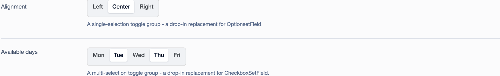
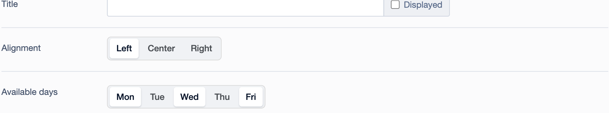

# Toggle Group Field for Silverstripe CMS

Form field subclasses that render as a segmented "toggle group" control -
styled after [shadcn/ui's toggle group component](https://ui.shadcn.com/docs/components/aria/toggle-group)
- instead of a list of radio buttons or checkboxes.

* `ToggleGroupField` is a drop-in replacement for `OptionsetField` (single selection)
* `ToggleGroupSetField` is a drop-in replacement for `CheckboxSetField` (multiple selection)

Both fields work anywhere a standard `getCMSFields()` field can be used,
including inside [Elemental](https://github.com/silverstripe/silverstripe-elemental)
content blocks.



*Above: `ToggleGroupField` (single-selection "Alignment") and
`ToggleGroupSetField` (multi-selection "Available days") added to a Page's
`getCMSFields()`.*



*Above: the same two fields added to a `DNADesign\Elemental\Models\BaseElement`
subclass's `getCMSFields()`, rendering identically inside the Elemental block
editor.*

## Requirements

* PHP ^8.3
* silverstripe/framework ^6
* dnadesign/silverstripe-elemental ^6 (optional, only if you want to use the fields inside Elemental blocks)

For Silverstripe CMS 5, use the `1` branch (`^1`).

## Installation

```
composer require wilr/silverstripe-togglegroup-field
```

Then run a `dev/build` and flush (`?flush=1`).

## Usage

Both fields extend their core Silverstripe equivalent, so they accept the
same constructor arguments, support the same saving behaviour (including
`has_one`/`many_many` relations and `DBMultiEnum`/JSON-encoded values), the
same validation, and the same readonly/disabled transformations. Only the
rendering changes.

### Single selection - `ToggleGroupField`

```php
use Wilr\ToggleGroupField\Forms\ToggleGroupField;

public function getCMSFields()
{
    $fields = parent::getCMSFields();

    $fields->addFieldToTab('Root.Main', ToggleGroupField::create(
        'Alignment',
        'Alignment',
        [
            'left' => 'Left',
            'center' => 'Center',
            'right' => 'Right',
        ]
    ));

    return $fields;
}
```

### Multiple selection - `ToggleGroupSetField`

```php
use Wilr\ToggleGroupField\Forms\ToggleGroupSetField;

public function getCMSFields()
{
    $fields = parent::getCMSFields();

    $fields->addFieldToTab('Root.Main', ToggleGroupSetField::create(
        'Days',
        'Available days',
        [
            'mon' => 'Mon',
            'tue' => 'Tue',
            'wed' => 'Wed',
            'thu' => 'Thu',
            'fri' => 'Fri',
        ]
    ));

    return $fields;
}
```

### Inside an Elemental block

Add the fields to a `DNADesign\Elemental\Models\BaseElement` subclass exactly
as you would on a `Page`:

```php
use DNADesign\Elemental\Models\BaseElement;
use Wilr\ToggleGroupField\Forms\ToggleGroupField;

class MyElement extends BaseElement
{
    private static $db = [
        'Alignment' => 'Varchar',
    ];

    public function getCMSFields()
    {
        $fields = parent::getCMSFields();

        $fields->addFieldToTab('Root.Main', ToggleGroupField::create(
            'Alignment',
            'Alignment',
            [
                'left' => 'Left',
                'center' => 'Center',
                'right' => 'Right',
            ]
        ));

        return $fields;
    }
}
```

Elemental's block editor is a schema-driven, React-rendered form (unlike a
classic `Page.getCMSFields()`, which is rendered server-side as plain HTML).
`OptionsetField` and `CheckboxSetField` normally declare a dedicated React
component for that context, which would bypass this module's template
entirely. Both fields here explicitly fall back to the generic `FormField`
schema component instead, so the same server-rendered markup - and therefore
the same styling and behaviour - is used everywhere, including inline and in
the "add block" modal.

### Style variants

```php
ToggleGroupField::create(/* ... */)
    ->setButtonsBlock(true)  // stretch options to fill the available width
    ->setButtonsSmall(true); // render a more compact button size
```

## Accessibility

Each option is rendered as a real `<input type="radio">` or
`<input type="checkbox">` paired with a `<label>` - the toggle-look buttons
are just CSS applied to native, always-keyboard-accessible form controls
(visually hidden with a `clip`-based technique rather than `display: none`,
so they remain focusable and readable by screen readers). This means:

* The field works correctly with no JavaScript at all.
* Tab moves focus in and out of the group as normal.
* For `ToggleGroupField`, arrow keys move the selection between options -
  this is native browser behaviour for radio inputs sharing the same `name`.
* For `ToggleGroupSetField`, arrow keys move focus (without changing
  selection) between checkboxes, matching the
  [WAI-ARIA toggle group keyboard pattern](https://ui.shadcn.com/docs/components/aria/toggle-group).
  This is implemented in `client/src/js/toggle-group.js` since checkboxes
  have no native roving-focus behaviour.
* The wrapping element uses `role="radiogroup"` (`ToggleGroupField`) or
  `role="group"` (`ToggleGroupSetField`) to describe the relationship
  between the options to assistive technology.

## Running the tests

```
composer install
vendor/bin/phpunit
```

## License

See [LICENSE](LICENSE)
